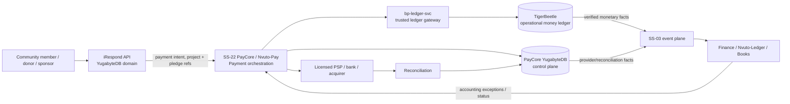
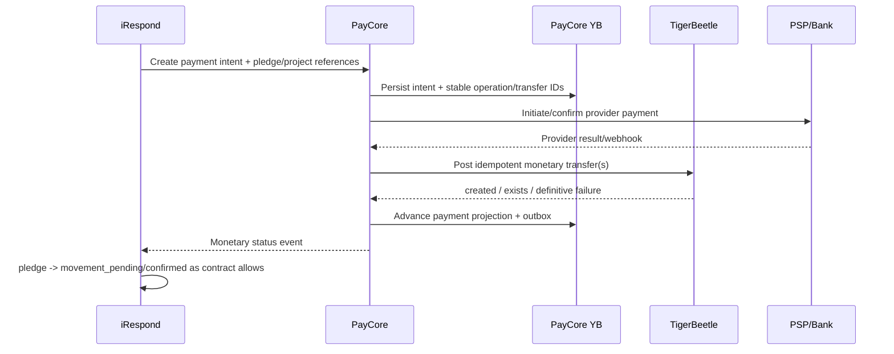
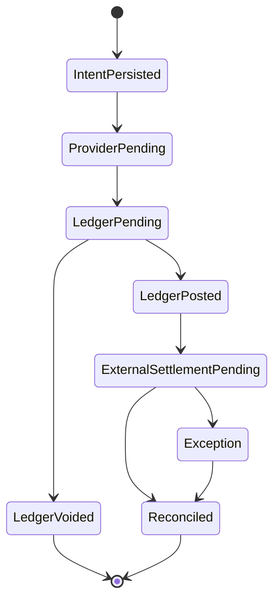

# TigerBeetle decision scope for iRespond and the Nvuto payment plane

Status: **PROPOSED — decision required before runtime implementation**  
Scope owner: iRespond product boundary + SS-22 PayCore / Nvuto-Pay architecture  
Frozen iRespond GA candidate: `6484873c8a0c3306a5972247bcc9981da4051bc6`  

## Executive decision

**Recommendation: adopt TigerBeetle as the canonical operational transaction and balance engine behind SS-22 PayCore / Nvuto-Pay, while keeping iRespond itself on YugabyteDB for community-action state and keeping Finance/Nvuto-Ledger or Books as the accounting/GL authority.**

TigerBeetle should not become iRespond's general database, project database, evidence store, impact ledger, pledge registry, identity store, geospatial store, or analytics warehouse. It should be introduced only when a commitment crosses the legal and technical boundary into actual money movement or a financially enforceable reservation/obligation.

This produces three deliberately different systems of record:

1. **iRespond + YugabyteDB** — why money may move: project, pledge, donor/contributor intent, campaign/funding plan, role, consent, milestone, evidence and impact context.
2. **PayCore/Nvuto-Pay + TigerBeetle** — what money is currently reserved, available, posted, refunded, charged back, owed or settled inside the operational money model.
3. **Finance/Nvuto-Ledger/Books** — how financial events are accounted for under accounting policy, chart of accounts, period controls, statutory reporting and audit.

This is a stronger architecture than either a YugabyteDB-only wallet ledger or embedding TigerBeetle directly in iRespond.

## Why the decision is timely

The existing iRespond funding domain already maintains the correct legal/product boundary. It stores funding plans and auditable pledges in YugabyteDB, uses states including `pledged`, `movement_pending` and `confirmed`, and deliberately does not claim that a pledge is settled money. The GA readiness ledger assigns regulated movement, refunds, reconciliation and financial controls to PayCore/payment providers.

Nvuto-Pay/BillyPay already contains a named Rust `bp-ledger-svc`, but the service is still only a bootstrap stub. Its accepted ADR currently proposes a custom append-only hash-chained Rust ledger. This means the estate has not yet accumulated a large migration burden around that custom ledger and can still choose a purpose-built financial transaction database cleanly.

The decision therefore is not "TigerBeetle versus YugabyteDB everywhere." It is whether the empty operational-ledger slot in PayCore should be filled by a custom financial ledger or TigerBeetle.

## Product boundary: where TigerBeetle fits and where it does not

| Capability | System | TigerBeetle? | Reason |
|---|---|---:|---|
| Need reporting, verification and project lifecycle | iRespond/YugabyteDB | No | Rich relational domain state, queries and workflows. |
| Funding plan and target | iRespond/YugabyteDB | No | A target is product metadata, not a balance. |
| Pledge/commitment before payment | iRespond/YugabyteDB | No | A pledge is not money. |
| Volunteer time, materials, skills, transport, access | iRespond/YugabyteDB | No | Non-monetary contribution lifecycle. |
| Impact Passport and evidence | iRespond/YugabyteDB + RustFS | No | Evidence and impact facts are not fungible balances. |
| Payment intent and provider routing | PayCore/YugabyteDB | Partly | Control-plane workflow stays in YB; monetary legs go to TigerBeetle. |
| Available wallet/safeguarded/restricted balance | PayCore/TigerBeetle | **Yes** | Atomic balance invariants and transaction ordering. |
| Authorization/hold/reservation | PayCore/TigerBeetle | **Yes** | Native pending transfers reserve funds and later post/void/expire. |
| Project restricted funds | PayCore/TigerBeetle | **Yes** | Prevents spending beyond funded/released amount. |
| Sponsor/matching pool | PayCore/TigerBeetle | **Yes** | Safe reservation and atomic linked legs. |
| Fees and revenue split | PayCore/TigerBeetle | **Yes** | Linked transfers can make multi-leg movement atomic. |
| Refund and chargeback monetary reversal | PayCore/TigerBeetle | **Yes** | Immutable corrective transfers preserve original history. |
| Provider webhook/event details | PayCore/YugabyteDB | No | Rich provider payload/control-plane data. |
| Reconciliation cases and evidence | PayCore/YugabyteDB | No | Operational case management and statements. |
| General ledger/statutory accounting | Finance/Nvuto-Ledger/Books | No | TigerBeetle is operational transaction infrastructure, not the whole ERP accounting model. |
| Analytics/BI/search | Warehouse/analytics plane | No | Use projections, CDC/outbox and analytic stores. |

## Recommended architecture



The most important rule in this diagram is that **iRespond never connects to TigerBeetle directly**. The only supported client should be a trusted PayCore ledger gateway/service. TigerBeetle itself has no authentication or permission system, so the surrounding application and network boundary must supply identity, authorization, policy and tenancy controls.

## What TigerBeetle adds

### 1. Atomic anti-overspend enforcement

For an account that represents a finite available balance, PayCore can configure the appropriate `debits_must_not_exceed_credits` or `credits_must_not_exceed_debits` invariant. A transfer that would breach the invariant fails inside the transaction engine. PayCore must not implement the unsafe pattern `read balance -> decide -> write debit`.

This is particularly useful for:

- project restricted funds;
- sponsor/matching budgets;
- contributor wallet balances if enabled;
- beneficiary payable balances;
- payout limits represented as financial control accounts;
- processor clearing/suspense accounts where an invariant is meaningful.

### 2. Native holds and reservations

TigerBeetle two-phase transfers model an authorization/hold naturally:

```text
available funds
   |
   +-- pending transfer --> reserved amount
                              |
                              +-- post --> final monetary movement
                              +-- void --> release reservation
                              +-- expire --> release after timeout
```

For iRespond this creates a clean distinction between a promise and a reservation. A pledge remains only in iRespond. If the user chooses a payment method where funds can be reserved, PayCore creates the pending TigerBeetle transfer. The UI can then truthfully distinguish **pledged**, **reserved/authorized**, **captured/posted**, **externally settled**, **refunded**, and **charged back**.

### 3. Atomic multi-leg transactions

Linked transfers can make a chain all succeed or fail together. That is valuable where one business operation contains multiple financial legs, for example:

- project funding amount + platform fee;
- sponsor match + contributor amount;
- marketplace split + fee;
- FX principal leg + counter-currency leg;
- payout + fee allocation;
- reserve/suspense movements coupled to a posting.

### 4. End-to-end idempotency

Every account and transfer carries a unique 128-bit identifier. PayCore should derive or allocate a stable transfer ID from a durable payment-operation idempotency record before submission and reuse exactly that ID on retry. An ambiguous network result then does not imply an ambiguous financial outcome: the same transfer can be resubmitted and TigerBeetle will not create it twice.

### 5. Strict serializability and immutable financial history

TigerBeetle executes the financial state machine under strict serializability. Transfers are immutable; corrections are new compensating/corrective transfers rather than destructive updates. This matches the audit and reconciliation goals already present in BillyPay.

## Money lifecycle for iRespond

### A. Pledge only — no TigerBeetle

```mermaid
sequenceDiagram
    participant U as User
    participant I as iRespond
    participant Y as YugabyteDB
    U->>I: Record pledge
    I->>Y: pledge status = pledged
    I-->>U: Commitment recorded; no money moved
```

The existing behavior should remain valid even after TigerBeetle is introduced.

### B. External donation / payment capture



Whether TigerBeetle should post before or after a provider message depends on the rail. The accounting contract must distinguish **internal operational posting** from **external settlement finality**. A TigerBeetle posting must never be presented as evidence that an external bank or card settlement occurred unless the relevant provider/reconciliation state proves it.

### C. Wallet or pre-funded sponsor contribution

When PayCore already controls an available balance, use a pending TigerBeetle transfer to reserve the amount before asynchronous downstream work. The account invariant prevents concurrent requests from reserving more than the available balance. Post after the governing condition succeeds; void/expire if it fails.

### D. Project milestone disbursement

If the regulatory/legal model permits iRespond-related funds to be held or allocated by the payment platform, model the release as a PayCore operation backed by TigerBeetle. A project-level restricted-funds account may be debited only to the extent funded. High-risk or high-value releases remain subject to PayCore authorization/two-actor policy before the ledger call.

Do not use the word **escrow** merely because TigerBeetle can reserve funds. Escrow is a legal/regulatory arrangement, not a database feature. The product terminology must follow the licensed custody/safeguarding model in each jurisdiction.

### E. Refunds, reversals and chargebacks

Never mutate or delete the original transfer. Create a new corrective transfer with a distinct ID and references to the payment operation/provider case in the PayCore control plane. Chargeback case files, deadlines and evidence stay in YugabyteDB; the monetary effect is reflected through TigerBeetle only when the applicable operational fact requires it.

## Proposed account model

This is an architecture model, not a final statutory chart of accounts. Finance and legal/compliance owners must validate the meaning of every account class.

| Account class | Typical normal balance | Example purpose |
|---|---|---|
| Provider/bank clearing asset | Debit | Amount expected from/across a PSP or bank rail. |
| Safeguarded cash asset | Debit | Cash controlled in the licensed/safeguarded structure. |
| Contributor/customer balance liability | Credit | Amount owed to an end user, if wallets are legally enabled. |
| Project restricted-funds liability | Credit | Money allocated/restricted to a project. |
| Sponsor matching-pool liability | Credit | Pre-funded sponsor resources still owed for eligible matches. |
| Beneficiary payable | Credit | Approved amount due for disbursement. |
| Processor/rail fee payable | Credit | Verified third-party fee obligation. |
| Platform fee/revenue clearing | Credit | Operational revenue leg pending GL recognition policy. |
| Refund/chargeback suspense | Either by design | Temporary controlled exception bucket. |

TigerBeetle `code` values should represent immutable account/transfer categories. Human-readable names, legal entity, project ID, tenant, provider references, KYC state and other rich metadata belong in PayCore YugabyteDB and should be mapped to TigerBeetle identifiers.

## Ledger partitioning and multi-currency

TigerBeetle's `ledger` identifier partitions accounts that may transfer directly. Different currencies should therefore use different ledger values. FX should not normalize everything into one accounting currency inside TigerBeetle; instead, model FX as atomically linked same-currency legs across the two currency ledgers using controlled liquidity accounts.

Recommended namespace policy:

```text
TigerBeetle cluster
  legal entity / residency deployment boundary
    ledger namespace
      legal-entity + tenant-partition-policy + currency/asset
        account codes
          safeguarded cash
          project restricted funds
          sponsor pools
          beneficiary payables
          fee/revenue clearing
          suspense/adjustment
```

The exact use of tenant-specific ledgers versus shared ledgers with tenant-specific account IDs should be benchmarked and reviewed for operational/cardinality constraints. Tenant segregation must not rely only on knowing a numeric account ID; authorization remains in PayCore.

## YugabyteDB remains necessary

TigerBeetle is deliberately not a replacement for the existing YugabyteDB standard. Nvuto-Pay's current operational policy already requires YugabyteDB/YSQL for runtime data, migration ledger, reconciliation, outbox delivery and provider/accounting workflow. That should continue.

YugabyteDB remains authoritative for:

- payment intent lifecycle and state machine metadata;
- tenant, legal entity and provider configuration;
- idempotency request records and mappings to TigerBeetle IDs;
- KYC/KYB/AML/risk decisions and policy evidence;
- payment method/token references (never raw prohibited secrets);
- provider webhook facts;
- reconciliation runs, matches and exceptions;
- refunds/chargeback case workflow;
- approval workflow and two-actor evidence;
- event/outbox state;
- mapping of TigerBeetle integer ledgers/codes to domain enums;
- audit context that does not belong in fixed-size financial records.

The rule should be: **TigerBeetle answers the operational financial truth; YugabyteDB explains the business and operational context of that truth.**

## Finance/Nvuto-Ledger remains necessary

The current reconciliation service already emits typed finance-accounting instructions such as `PAYMENT_REFUNDED`, `PAYOUT_SETTLED`, `CHARGEBACK_CREATED` and `PAYMENT_FEE_ASSESSED` through an idempotent outbox/delivery mechanism. TigerBeetle should strengthen the monetary source facts feeding this pipeline, not replace the Finance accounting destination.

Finance/Nvuto-Ledger/Books should continue to own:

- chart of accounts;
- journals and accounting policy;
- approval/post/reverse accounting lifecycle;
- accounting periods and close;
- statutory and management reports;
- tax/accounting dimensions;
- trial balance and financial statements;
- audit evidence and policy exceptions.

A useful shorthand is:

> TigerBeetle is the **money movement state machine**. Finance is the **accounting interpretation and reporting system**.

## Cross-database consistency: no distributed 2PC

PayCore must not attempt a distributed ACID transaction spanning YugabyteDB, TigerBeetle and a payment provider. The robust pattern is a durable operation/saga with stable identifiers and idempotent retries.



Required invariants:

1. A PayCore operation has a durable idempotency key before external side effects.
2. TigerBeetle account/transfer IDs are deterministic or durably persisted before submission.
3. The same TigerBeetle ID is retried after an ambiguous response; never generate a fresh ID merely because the network timed out.
4. A provider callback is idempotently ingested before state transition.
5. YugabyteDB projections may lag TigerBeetle but cannot invent a balance outcome.
6. The ledger gateway can reconcile the YB projection from TigerBeetle by stable identifiers.
7. Downstream Finance/event consumers are idempotent because replay is expected.
8. External provider settlement is reconciled independently; TigerBeetle alone does not prove bank/card settlement.

## Security boundary

TigerBeetle does not provide authentication or authorization. Therefore:

- no mobile/web client connects to TigerBeetle;
- no iRespond service connects directly to TigerBeetle;
- only the private PayCore ledger gateway may connect;
- SS-07/StratoID/SS-13 govern caller identity and authorization before a ledger command exists;
- workload identity and network policy isolate the ledger gateway;
- TigerBeetle replica ports remain private and non-public;
- no user-controlled strings or arbitrary account/ledger codes are passed without validated mappings;
- high-value money-out still uses PayCore policy and two-actor approval;
- provider reconciliation remains an independent check against internal ledger state.

## Production topology recommendation

For production, follow TigerBeetle's current recommendation of a **six-replica cluster**, preferably arranged across three nearby fault domains/sites with two replicas per site. Replicas should have independent local storage; production hardware should use ECC memory and local NVMe where practical. Sites should have low inter-site latency because transactions are replicated before commit.

Do not make a Kubernetes StatefulSet the default production deployment merely for platform uniformity. TigerBeetle's operating guidance favors dedicated machines and its Docker guidance is not the preferred production path. SkyForge should therefore treat TigerBeetle as a first-class dedicated-stateful infrastructure target: provision hosts, disks, addresses, systemd/supervision, private networking, version/upgrade control, backup/recovery procedures and observability. Kubernetes-hosted application services can reach the private ledger gateway; the TigerBeetle replicas themselves need not live inside Kubernetes.

Because a TigerBeetle cluster's replica count is selected at format time, capacity/resiliency architecture needs to be decided before production initialization. Throughput scaling is also not equivalent to adding replicas: TigerBeetle is single-threaded by design and replication adds reliability rather than horizontal transaction throughput. Partitioning/sharding, if ever required, must therefore be an explicit financial-domain design decision, not an emergency autoscaling action.

## Impact on existing BillyPay ADRs

TigerBeetle adoption should not silently coexist with contradictory ADRs.

### ADR-BP-001 — custom append-only hash-chained Rust ledger

**Recommended change:** supersede the custom storage/state-machine portion. Retain `bp-ledger-svc` as the Rust (or supported-client-language) service boundary, but make TigerBeetle the transactional storage/consistency engine behind it. If an independent tamper-evidence digest/export chain is still required for audit packaging, implement it as a downstream evidence/projection function rather than a second mutable balance authority.

### ADR-BP-002 — idempotency at every layer

**Keep and strengthen.** Map the external/tenant idempotency key to a stable PayCore operation ID and stable TigerBeetle transfer/account identifiers.

### ADR-BP-005 — two-stage disbursement / two-actor money-out

**Keep.** Human/policy authorization remains outside TigerBeetle. A pending transfer can represent the financial reservation after authorization; post occurs only at the appropriate commit point.

### ADR-BP-006 — three-way reconciliation

**Expand.** Reconciliation becomes provider/bank ↔ PayCore control plane ↔ TigerBeetle operational ledger ↔ Finance/Books. The goal remains that every externally settled cent is explainable across all layers.

### ADR-BP-007 — tenant-segregated trust accounts

**Keep as a regulatory/product requirement**, but do not confuse an internal TigerBeetle account with a legally segregated bank/trust/safeguarding account. The internal ledger must mirror the real legal custody model.

### ADR-BP-011 — NUMERIC(18,4)

**Clarify/supersede for the hot ledger.** TigerBeetle uses fixed-size unsigned integer amounts, not SQL decimal. PayCore must define a canonical integer scale per currency/asset and perform checked conversion at the boundary. YugabyteDB/Finance may retain exact decimal representations where required, but conversion rules must be deterministic and reject precision loss.

## Proposed amount/scale contract

Use integer minor units or an explicitly versioned asset scale. Examples are illustrative:

| Asset | Scale | Display amount | TigerBeetle amount |
|---|---:|---:|---:|
| USD | 2 | 125.40 | 12540 |
| NGN | 2 | 5000.00 | 500000 |
| JPY | 0 | 5000 | 5000 |

Do not assume every currency permanently has two decimal places and do not accept binary floating-point money at the boundary. Currency metadata should be immutable/versioned configuration in the PayCore control plane.

## Observability and reconciliation

Minimum production telemetry should include:

- replica/cluster availability and primary status;
- request latency and batching behavior;
- ledger gateway queue depth and error classes;
- idempotent `exists` vs newly created results;
- pending transfer age/expiry counts;
- account invariant failures by operation class;
- YB projection lag from ledger outcomes;
- provider ↔ TigerBeetle reconciliation differences;
- Finance delivery lag and DLQ/retry state;
- disk/NVMe health, NTP/clock, network, CPU and memory;
- recovery/replica-replacement drills with dated evidence.

TigerBeetle CDC can be evaluated for downstream event propagation, but its delivery semantics are at-least-once, so consumers must deduplicate. The existing PayCore outbox may remain the initial integration path because it already carries rich business/provider context and has explicit delivery state.

## Suggested rollout

| Phase | Scope | Exit criteria |
|---|---|---|
| TB-0 Decision | Approve architecture, ownership, terminology and ADR supersession | Signed architecture decision; no runtime change. |
| TB-1 Ledger kernel | Replace `bp-ledger-svc` stub with TigerBeetle-backed account/transfer API in isolated test environment | Golden double-entry tests, idempotency, invariant, linked and pending-transfer tests. |
| TB-2 PayCore shadow | Map payment operations to TigerBeetle while existing YB/accounting path remains comparison authority | Deterministic parity/reconciliation report; no customer balance served from TB yet. |
| TB-3 Non-custodial iRespond rail | Use TigerBeetle for internal payment-operation facts where provider owns custody; keep pledge-only UI boundary | End-to-end sandbox provider + TB + reconciliation + Finance evidence. |
| TB-4 Wallet/restricted funds | Enable balances/reservations only in jurisdictions/licensed models that permit them | Legal/regulatory approval, safeguarding/custody mapping, external security/ops evidence. |
| TB-5 Multi-currency/FX | Introduce per-currency ledgers and linked FX legs | Liquidity/FX controls, rate provenance, reconciliation and accounting sign-off. |
| TB-6 Production HA | Dedicated six-replica production cluster(s) and regional/legal-entity topology | Failure drills, monitoring, upgrade/recovery, capacity, RPO/RTO and independent review. |

## Decision matrix

| Option | Correctness for balances/holds | Product coupling | Operational complexity | Reuse across Nvuto | Recommendation |
|---|---:|---:|---:|---:|---|
| Keep everything in YugabyteDB | Medium-High if carefully engineered | Low | Medium | Medium | Viable, but requires building more ledger invariants/concurrency logic ourselves. |
| Put TigerBeetle directly in iRespond | High financial primitive quality | **Very high / wrong boundary** | High | Low | **Reject.** Makes a community platform own regulated ledger infrastructure. |
| Provider ledger only | Depends on provider | High vendor coupling | Low initially | Low | Reject as canonical architecture; useful only as external reconciliation source. |
| Custom Rust ledger (`ADR-BP-001`) | Depends entirely on our implementation | Medium | **Very high engineering/safety burden** | High | Do not prefer while TigerBeetle satisfies the core transaction problem. |
| **TigerBeetle behind PayCore/Nvuto-Pay** | **High** | **Low for iRespond** | Medium-High, concentrated in finance platform | **Very high** | **Recommended.** |

## Risks and mitigations

| Risk | Mitigation |
|---|---|
| Team treats TigerBeetle as a general database | Enforce the YB control-plane/TB data-plane boundary in architecture tests and service ownership. |
| Direct access bypasses auth | Network isolate TB; only ledger gateway can connect. |
| YB and TB diverge | Stable IDs, idempotent saga, repair/replay tooling and continuous reconciliation. |
| Provider settlement differs from internal posting | Explicit external-settlement state; provider reconciliation remains independent. |
| Decimal conversion errors | Integer scale registry, checked conversion, no floats, property tests. |
| Operational unfamiliarity | Dedicated runbooks, recovery drills, upgrade qualification and SkyForge provisioning module. |
| Cluster cannot simply autoscale by adding replicas | Capacity test before launch; partition by legal entity/region/asset only by deliberate design. |
| "Escrow" or "wallet" creates regulatory claims | Product terminology and capability flags depend on jurisdiction/licensing approval, not ledger mechanics. |
| Existing custom-ledger ADR becomes ambiguous | Formally supersede/replace ADR-BP-001 and clarify ADR-BP-011 before implementation. |

## Decision requested

Choose one of the following:

**A — APPROVE (recommended):** TigerBeetle becomes the canonical operational money ledger behind SS-22 PayCore/Nvuto-Pay. Begin TB-1 in `Atlasfsp/Nvuto-Pay`; preserve YugabyteDB as control plane and Finance/Nvuto-Ledger/Books as GL. iRespond remains pledge/domain-only until a PayCore money-movement contract is certified.

**B — APPROVE FOR PROTOTYPE ONLY:** build TB-1 plus shadow reconciliation, but do not designate it canonical until parity, failure and operations evidence is reviewed.

**C — DEFER:** retain the decision document but continue with the custom ledger/YugabyteDB path for now.

**D — REJECT:** TigerBeetle is not adopted; document the reason and harden the custom ledger as the strategic financial transaction engine.

## Recommendation in one sentence

> **Approve A: use TigerBeetle as the shared, private operational transaction/balance engine inside Nvuto-Pay/PayCore — never as iRespond's general database and never as a replacement for YugabyteDB or the Finance/GL ledger.**

## Primary reference material

- TigerBeetle System Architecture: https://docs.tigerbeetle.com/coding/system-architecture/
- Two-Phase Transfers: https://docs.tigerbeetle.com/coding/two-phase-transfers/
- Reliable Transaction Submission: https://docs.tigerbeetle.com/coding/reliable-transaction-submission/
- Linked Events: https://docs.tigerbeetle.com/coding/linked-events/
- Data Modeling: https://docs.tigerbeetle.com/coding/data-modeling/
- Currency Exchange recipe: https://docs.tigerbeetle.com/coding/recipes/currency-exchange/
- Cluster Recommendations: https://docs.tigerbeetle.com/operating/cluster/
- Hardware: https://docs.tigerbeetle.com/operating/hardware/
